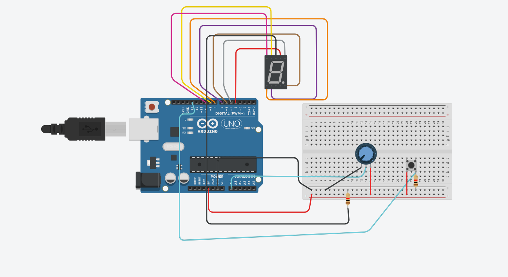

<h1>This project control a 7-segment display from a potentiometer, cleaning the display with a push button</h1>

*<h3>Materials:</h3>*
  <li>7-segment display</li>
  <li>1 push button</li>
  <li>Jumpers</li>
  <li>2 ohmic resistors</li>
  <li>1 potentiometer</li>
 

