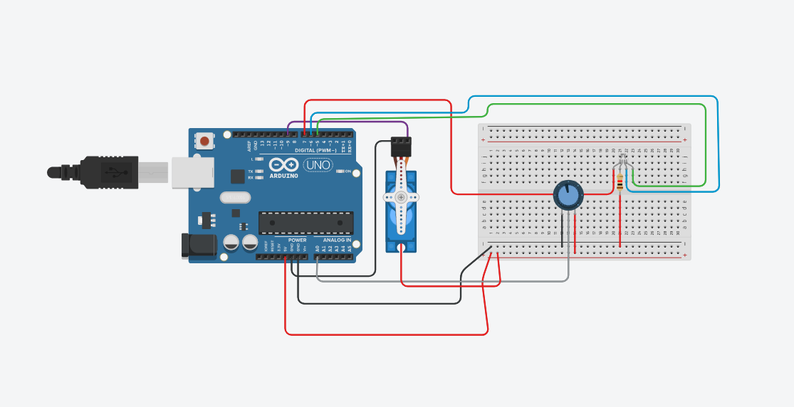

<h1>Control a micro servo from a potentiometer and set colors in a rgb led</h1>

*<h3>Materials:</h3>*
  <li>1 micro servo</li>
  <li>1 led RGB</li>
  <li>1 potentiometer</li>
  <li>Some jumpers</li>
  <li>1 ohmic resistor</li>
 

